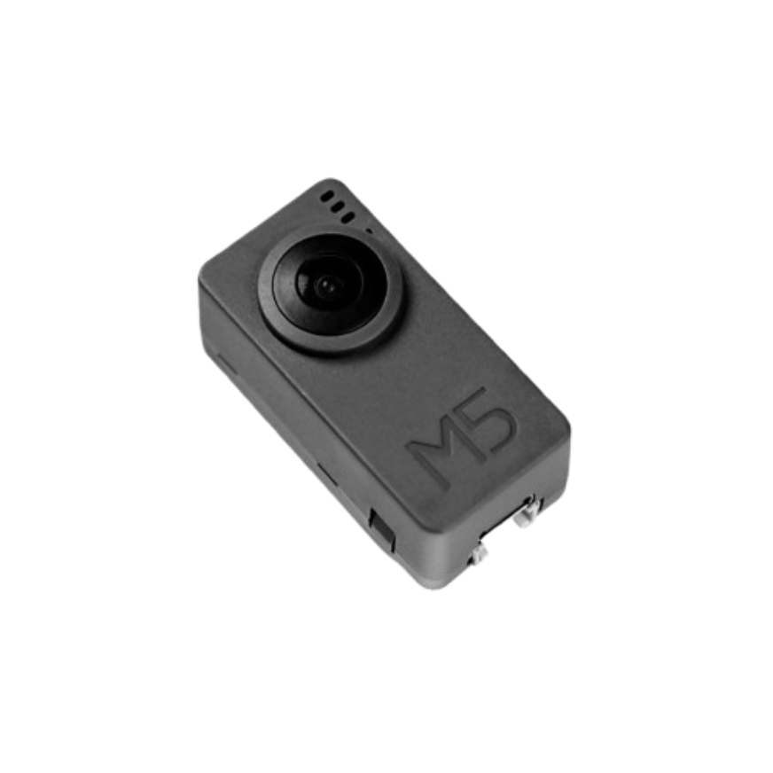
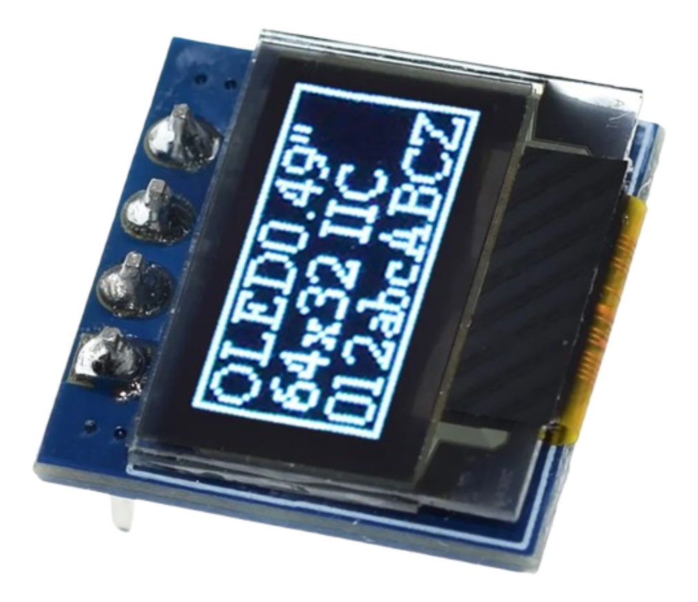

# M5TimerCAM Pixel Camera

A custom firmware for the M5Stack TimerCAM.



## Hardware

 - M5Stack TimerCAM (ESP32-based camera module)
 - OV3660 camera sensor
 - 0.49" OLED display (SSD1306, 64X32 pixels)

## Features

- Real-time camera image processing
- Pixel art filter
- Pico-8 inspired color palette
- OLED display output for live preview
- **Web interface** for photo management (download and delete)
- Photo storage on internal flash (LittleFS)
- Low-power timer-based operation

## Web Interface

The camera includes a built-in web server for managing captured photos.

1. Select "Export" from the on-device menu:
2. The camera will connect to the WiFi network with credentials from your `config.h`
3. Open your browser and navigate to the device's IP address
4. From the web interface you can:
   - **Download** individual photos
   - **Delete** specific photos to free up space
   - **Delete all** photos at once
   - View storage statistics (used/free space, photo count, estimated remaining capacity)

The interface features a modern, dark-themed grid layout showing all captured photos with file sizes and easy-to-use controls.

### Menu Navigation

https://github.com/raulzanardo/m5timercam-pixel-camera/assets/video_1.mp4

This video demonstrates the on-device menu system including the export mode.

## Live preview

I added a small OLED display to the back of the case so the camera image could be previewd. The image is precessed with dithering and size reduction, it is not the best image but you can kind of figure it ou what is going on. I also had to remove the current two batteries of the case to give space to the display.




## Prerequisites

- [PlatformIO](https://platformio.org/) installed
- USB cable for programming
- M5TimerCAM device

## Setup

1. Clone this repository:
   ```bash
   git clone https://github.com/raulzanardo/m5timercam-pixel-camera.git
   cd m5timercam-pixel-camera
   ```

2. Create your configuration file:
   ```bash
   cp include/config.example.h include/config.h
   ```

3. Edit `include/config.h` with your settings (WiFi credentials, camera parameters, etc.)

## Building

Build the firmware using PlatformIO:

```bash
pio run
```

## Flashing

Upload to your M5TimerCAM:

```bash
pio run --target upload
```

Monitor serial output:

```bash
pio device monitor
```

## Configuration

Edit `include/config.h` to customize:
- WiFi settings
- Camera resolution and quality
- Filter parameters
- LED behavior
- Power management

See `include/config.example.h` for available options.

## Project Structure

```
├── src/
│   ├── main.cpp          # Main application logic
│   └── filter.cpp        # Image filter implementations
├── include/
│   ├── config.h          # User configuration (git-ignored)
│   ├── config.example.h  # Configuration template
│   ├── filter.h          # Filter definitions
│   └── palette_pico.h    # Pico-8 color palette
├── platformio.ini        # PlatformIO configuration
└── partitions_camera.csv # ESP32 partition table
```

## TODO

Future improvements and features to implement:

- **Bigger flash chip** - Upgrade to larger flash memory for:
  - More filter options and palettes
  - Image storage capability
  - Extended feature set without memory constraints
- **Additional color palettes** - Game Boy, CGA, C64, custom palettes
- **SD card support** - Save captured images locally
- **Multiple filter modes** - Switch between different artistic effects
- **Timelapse mode** - Automated interval shooting

## License

This project is licensed under the MIT License - see the [LICENSE](LICENSE) file for details.

## Contributing

Contributions are welcome! Please feel free to submit a Pull Request.
