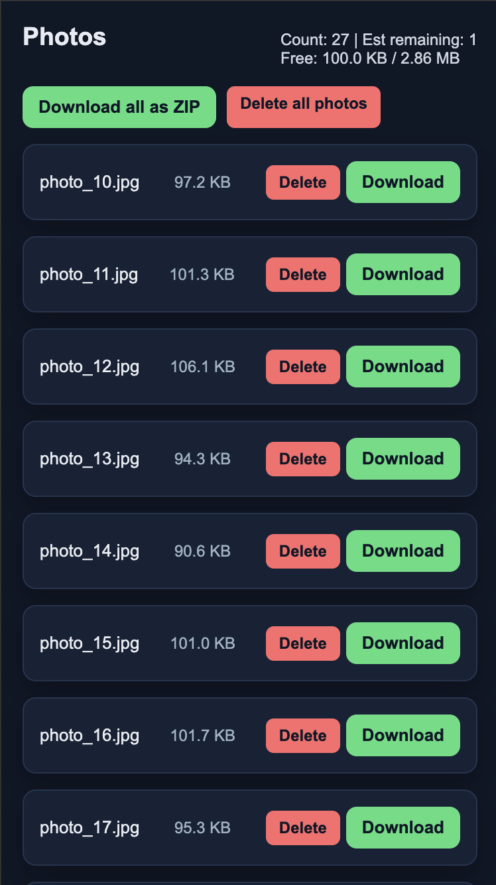
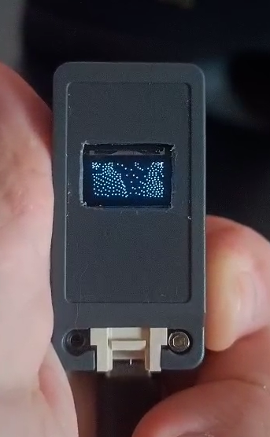
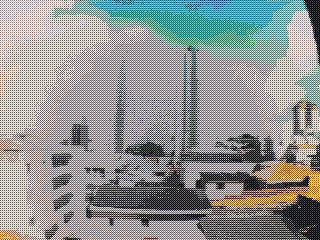
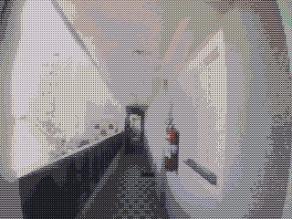

# M5TimerCAM Pixel Camera

A custom firmware for the M5Stack TimerCAM focused on low-power shooting, live preview, filtered captures, and Wi-Fi photo export.

<p align="center">
  
</p>

[M5Stack TimerCamera-F](https://docs.m5stack.com/en/unit/timercam_f)

## Hardware

- M5Stack TimerCAM (ESP32-based camera module)
- OV3660 camera sensor
- Internal flash chip upgraded from 4MB to 16MB, with a custom partition layout for firmware plus a large LittleFS photo partition
- 0.49" OLED display (SSD1306, 64X32 pixels)
- Battery changed from the default pack to make room for the rear OLED screen

## Button GPIO problem

Make sure to check this forum thread about the TimerCam buttons GPIO not having the pull up resistor in it.

[TimerCam Power/Wake button docs - G38 instead of G37](https://community.m5stack.com/topic/4530/timercam-power-wake-button-docs-g38-instead-of-g37)

## Features

- Live OLED preview with center-cropped scaling from the camera sensor
- One-button photo capture from the live view
- Optional pixel-art capture with auto-adjust and selectable color palette (Pico-8 or Elevate)
- Faster unfiltered capture path using the sensor's hardware JPEG mode
- Photo storage on LittleFS under `/photos`
- Persistent photo numbering across reboots and filesystem re-scan protection against overwriting old shots
- Persistent menu settings stored in Preferences:
  - selected palette (off / pico / elevate)
  - wake-shot on/off
  - next photo index
- Wake-on-button capture mode that can boot, take a picture automatically, show the result, and return to deep sleep
- Wi-Fi export mode with a browser interface for browsing and managing saved photos
- Power-saving runtime behavior:
  - Wi-Fi and Bluetooth off by default
  - lower CPU frequency during normal camera operation
  - higher CPU frequency only while exporting over Wi-Fi
  - reduced live-preview XCLK to cut active power
  - camera, OLED, and radio shutdown before deep sleep

## Capture Pipeline

The firmware uses two capture paths depending on the palette selector:

- `Palette off`: capture directly as JPEG for faster saves and lower processing cost
- `Palette on (pico or elevate)`: capture as RGB565, auto-adjust brightness/contrast, apply Bayer ordered dithering, quantize to the selected palette, then encode to JPEG

The live preview is separate from the saved photo path. It runs in grayscale, rescales the current frame to fit the OLED, and applies error-diffusion dithering so the tiny display stays readable.

### Bayer Dithering

The ordered dithering uses a centered-bin integer Bayer matrix with a tuned amplitude (70% of full range) and a slight dark bias to balance the visual output across 2×2, 4×4, and 8×8 matrix sizes.

### Color Palettes

| Name        | Description                                                                                |
| ----------- | ------------------------------------------------------------------------------------------ |
| **Pico-8**  | 16-color videogame-inspired palette: bright primaries, pastels, and earth tones            |
| **Elevate** | 16-color cinematic palette: warm earth tones, deep blues, muted greens, and accent purples |

## On-Device Controls

- `Short press` from live view: capture a photo
- `Long press` from live view: open the menu
- `Short press` inside the menu: move to the next item
- `Long press` inside the menu: activate the selected item
- `Double click` inside the menu: exit the menu

Menu items:

- `off`: shut down peripherals and enter deep sleep
- `export`: connect to Wi-Fi and start the web export server
- `palette`: cycle the capture palette — `off` → `pico` → `elevate`
- `wake`: toggle wake-shot mode
- `status`: show battery percentage and free LittleFS space

When export mode is active, the OLED displays the device IP address. Leaving the menu stops the web server and turns Wi-Fi back off.

## Wake-Shot Mode

Wake-shot is meant for quick, low-interaction shooting:

- Enable `wake` in the menu once
- Put the device to sleep with the `off` menu item
- Press the hardware button to wake it
- On wake, the firmware automatically captures a photo, shows `photo saved` or `photo error`, then returns to deep sleep after a short delay

This mode is useful when you want the camera to behave more like a pocket snapshot device instead of staying in the live preview loop.

## Web Interface

The camera includes a built-in web server for exporting and managing captured photos.

1. Select "Export" from the on-device menu:
2. The camera will connect to the WiFi network with credentials from your `config.h`
3. Open your browser and navigate to the device's IP address
4. From the web interface you can:
   - View all saved photos in reverse chronological order
   - **Download** individual photos
   - **Download all photos as a ZIP**
   - **Delete** specific photos to free up space
   - **Delete all** photos at once
   - View storage statistics (used/free space, photo count, estimated remaining capacity)

The interface uses a simple responsive grid and shows each filename, size, and action buttons.

<p align="center">
  
</p>

### Menu Navigation

This video demonstrates the on-device menu system including the export mode.

Long press enters the menu. While in the menu, a short press cycles through items, long press activates the selected item, and a double click exits back to the live preview.

<p align="center">
  
  
</p>

## Live preview

I added a small OLED display to the back of the case so the camera image could be previewed before taking a shot. To make space for that rear display, the original battery setup was replaced with a different one that fits the modified enclosure better. The firmware scales and center-crops the camera frame, then applies monochrome dithering to make the 64x32 display usable. The result is intentionally rough, but good enough to frame a scene and confirm that the camera is awake and pointed in the right direction.

https://github.com/user-attachments/assets/38396504-9a6e-4b44-8a0a-ec52146e3762

## Sample Photos

Photos captured with the M5TimerCAM using the pixel art filter. The palette menu item selects which color set is applied — `pico` uses the classic Pico-8 palette and `elevate` uses a warmer, more cinematic palette:

<p align="center">
  
  
</p>

## Prerequisites

- [PlatformIO](https://platformio.org/) installed
- USB cable for programming
- M5TimerCAM device

## Setup

1. Clone this repository:

   ```bash
   git clone https://github.com/raulzanardo/m5timercam-pixel-camera.git
   cd m5timercam-pixel-camera
   ```

2. Create your configuration file:

   ```bash
   cp include/config.example.h include/config.h
   ```

3. Edit `include/config.h` with your settings (WiFi credentials, camera parameters, etc.)

4. If you are using the larger-flash hardware mod or board definition in this repository, keep the provided partition table and board configuration so LittleFS can use the extended storage area.

## Building

Build the firmware using PlatformIO:

```bash
pio run
```

## Flashing

Upload to your M5TimerCAM:

```bash
pio run --target upload
```

Monitor serial output:

```bash
pio device monitor
```

## Configuration

Edit `include/config.h` to customize:

- WiFi settings
- Camera resolution and quality
- Filter parameters
- LED behavior
- Power management
- Wake-shot timing
- Export timeout and estimated photo size
- Menu labels and display constants

See `include/config.example.h` for available options.

## Project Structure

```
boards/
  m5stack-timer-cam-bigger.json   # 16MB board definition
include/
  config.h                        # User configuration (git-ignored)
  config.example.h                # Configuration template
lib/
  camera/                         # Camera init, capture, preview, sleep
  filter/                         # Auto-adjust, Bayer dithering, and palette filtering
    palette.h                     # Pico-8 and Elevate color palette definitions
  ui/                             # OLED menu and button-driven UI
  web/                            # Wi-Fi export server
src/
  main.cpp                        # Application boot and main loop
platformio.ini                    # PlatformIO environment
partitions_camera.csv             # 16MB flash partition layout
```

## TODO

Future improvements and features to implement:

- **Additional color palettes** - Game Boy, CGA, C64, custom palettes
- **SD card support** - Save captured images locally
- **Timelapse mode** - Automated interval shooting

## License

This project is licensed under the MIT License - see the [LICENSE](LICENSE) file for details.

## Contributing

Contributions are welcome! Please feel free to submit a Pull Request.
